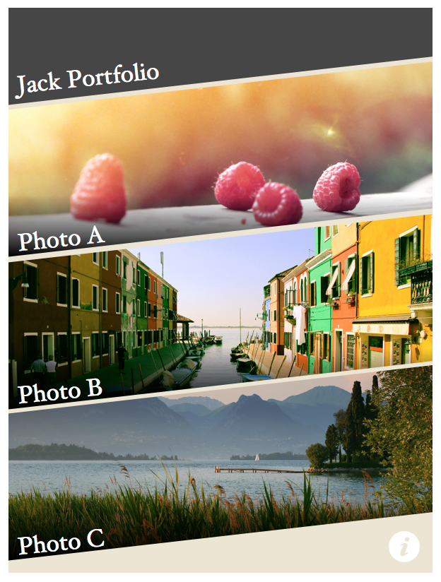

:sectnums:
= Project 1—Basic app with animated transitions
In this project, we are going to build a designer portfolio. There is stylish navigation menu, animated transitions and static photos viewer.

I have recorded a video of the app example that shows the animated transition. You may take a look to have a better understandings on what we are building.

https://vimeo.com/109947581[http://mak.la/cjs-demo1]

:sectnums!:
include::mission-checklist.adoc[]

include::project-preparation.adoc[]

:sectnums:
include::step1.adoc[]

include::step2.adoc[]

include::step3.adoc[]

include::step4.adoc[]

include::step5.adoc[]

include::step6.adoc[]

include::step7.adoc[]

:sectnums!:
== Further challenges

There are some essential features we haven’t implemented in the example app.

For example, we don’t have scrolling in the menu scene so we can’t display more photos.
