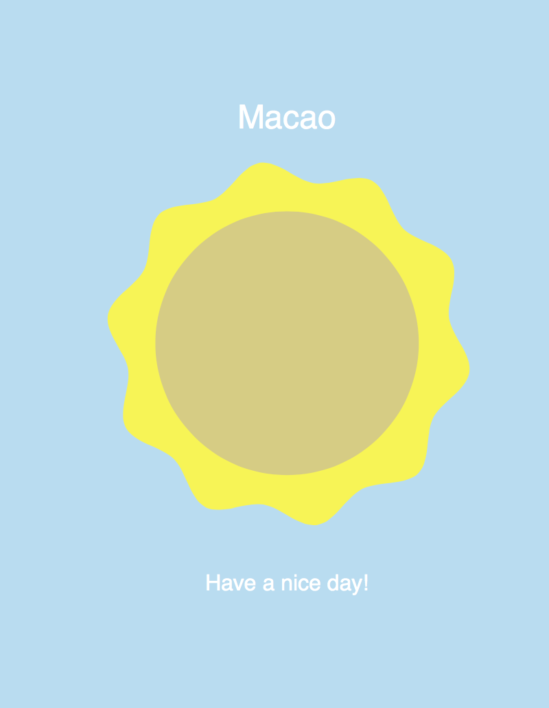

:sectnums:
= Project 2—Rain or Not?

In this project, we create an app that helps the user knows if they need to begin the umbrella each day. It serves one single purpose which fetches the weather. In this example, we only care about the rainy day and the sunny say. In the future, you may modify it to support more weather conditions such as windy and snow days.

Before we get started into the project, here is the screenshot of what we are going to build. You can also try the project demo with the following link. I recommend you go try it so you can map the code with the app that we are building.

http://mak.la/demo-rain-or-not

== Why this project is awesome

We have created an information based app in last example. In this example, we will explore how we can separate the logic into data, view and controlling logic. This is known as MVC, modal-view-controller.

We try to separate the logic, data and the view. This ensues that each module of code is minimal and so they are easy to maintain.

:sectnums!:
include::mission-checklist.adoc[]

:sectnums:
include::step1.adoc[]

include::step2.adoc[]

include::step3.adoc[]

include::step4.adoc[]

include::step5.adoc[]

include::step6.adoc[]

include::step7.adoc[]

include::step8.adoc[]

:sectnums!:

//== Further challenges

== Summary

In this project, we learnt to define our logic into different modules for easier maintenance. The logic is divided into data querying, view rendering and controller that bridges between data and view.

We also learned to control pre-defined symbol instances that was exported from Adobe Flash.

At last, we listen to the device orientation to get the 3 axis value of device rotation.
