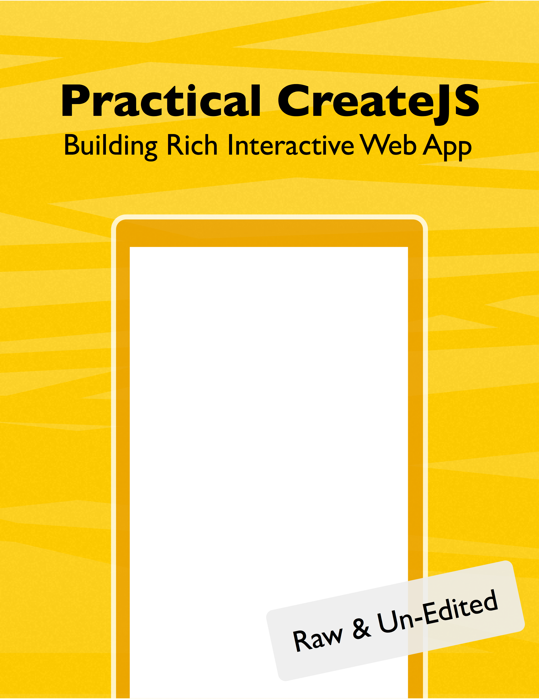

= Practical CreateJS
Makzan <mak@makzan.net>
v2.0, October 10, 2015: AsciiDoc Rewrite
:doctype: book
:docinfo:
:toc: left
:toclevels: 2
:sectnums:
:linkcss:
:source-highlighter: highlightjs
:front-cover-image: 

A short book about using CreateJS.

include::book/01-frontmatter/0-frontmatter.adoc[leveloffset=+1]

include::book/02-preparation/0-preparation.adoc[leveloffset=+1]

include::book/03-project1/0-project1.adoc[leveloffset=+1]

include::book/04-project1b/0-project1b.adoc[leveloffset=+1]

include::book/05-project2/0-project2.adoc[leveloffset=+1]

include::book/06-project3/0-project3.adoc[leveloffset=+1]

include::book/07-project4/0-project4.adoc[leveloffset=+1]

include::book/08-project4b/0-project4b.adoc[leveloffset=+1]

include::book/99-backmatter/0-backmatter.adoc[leveloffset=+1]
